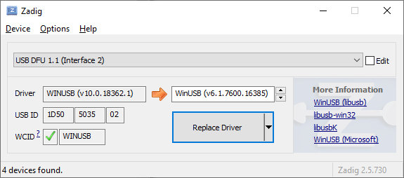
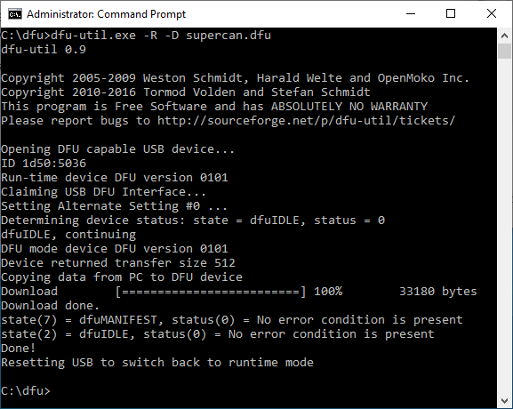
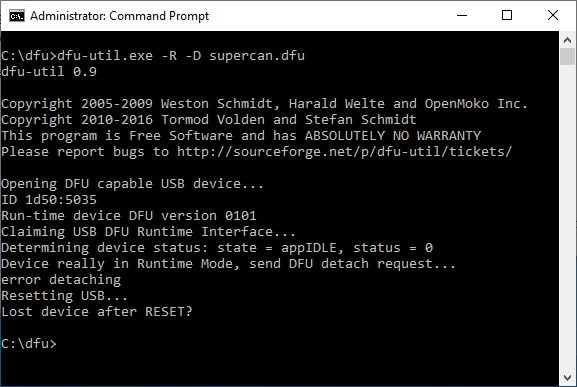
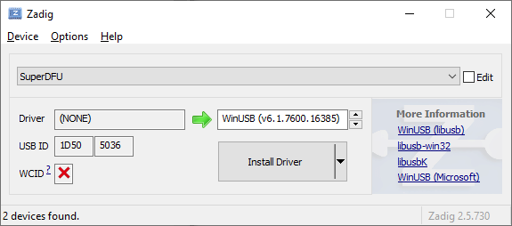

# Firmware Update

Ensure you have [Zadig](https://zadig.akeo.ie/) available as well as [dfu-util](http://dfu-util.sourceforge.net/releases/).

Below you'll find the steps that worked for me on my Windows 10 (x64) machine. Your mileage may very well vary.

## Steps

1. Plug in the device.
2. Open Zadig (as Administrator).
3. From the menu, select _Options_ -> _List All Devices_
4. Select USB DFU 1.1 in the combo box.

	Select `WinUSB (v6.1)` as the new driver, then press `Replace Driver`.

	

5. Open an administrative terminal (cmd.exe, _Run as Administrator_)

6. Reset the device and (try to) flash firmware.

	Note that I have copied dfu-util and the firmware into `C:\dfu`

	`dfu-util -d 1d50:5035,:5036 -R -D supercan.dfu`

	

	If all went well you should get output like this:

	

7. Replug the device to return to normal operation.

## Troubleshooting

Its not always rainbows and unicorns though, is it?

### **Step 6** fails with `Lost device after RESET?`

Most likely you don't have a compatible driver set for the device in DFU mode.

#### Fix

1. Open _Zadig_.
2. Select `SuperDFU`. See below.
3. Install or replace the driver with `WinUSB (v6.1)`.

	

4. Try flashing the firmware again from step 6.

## Hints

* Have the _Device Manager_ open while performing driver assignment.
	* Enable the display of _Hidden Devices_ through the _Views_ menu.
	* You can _undo_ a driver assignment performed through _Zadig_ by selecting the device, then pressing _Del_ on the keyboard, and then confirming that you want to _Uninstall driver software_. You may need to replug the device afterwards.

* By the looks of it dfu-util v0.10 _does not_ work. However, v0.9 works fine.