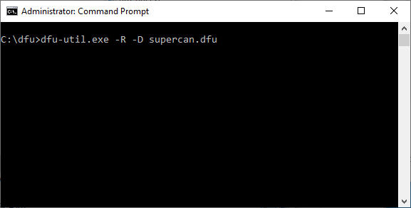

# SuperCAN Firmware Update Guide for Windows

Ensure you have [dfu-util](http://dfu-util.sourceforge.net/releases/) available.

## SuperCAN Firmware Update Guide

_Do you know if your devices uses the CAN application and bootloader found in [Release 1.0.11](https://github.com/jgressmann/supercan/releases/tag/v1.0.11) or better?_


*Yes: Follow theses steps:*

1. Plug in the device.
2. Open a terminal window (`cmd.exe`).
3. Flash the CAN application.

	`dfu-util -d 1d50:5035,:5036 -R -D supercan.dfu`


*No: follow the steps in the next section.*

### Zadig Driver Setup and Firmware Update

Ensure you have [Zadig](https://zadig.akeo.ie/) available on your system.

1. Plug in the device.
2. Open Zadig (as Administrator).
3. From the menu, select _Options_ -> _List All Devices_.
4. Select USB DFU 1.1 in the combo box.

	Select `WinUSB (v6.1)` as the new driver, then press `Replace Driver`.


	

5. Open an administrative terminal (`cmd.exe`, _Run as Administrator_)

6. Reset the device and (try to) flash the CAN application firmware.

	Note that I have copied dfu-util and the firmware into `C:\dfu`

	`dfu-util -d 1d50:5035,:5036 -R -D supercan.dfu`

	


	If all went well you should get output like this:

	

7. Replug the device to return to normal operation.


## Troubleshooting

Its not always rainbows and unicorns though, is it?

### **Step 6** of _Firmware Update with Zadig_ fails with `Lost device after RESET?`


Most likely you don't have a compatible driver set for the device in DFU mode.

#### Fix

1. Open _Zadig_.
2. Select `SuperDFU`. See below.
3. Install or replace the driver with `WinUSB (v6.1)`.

	


4. Try flashing the firmware again from step 6.

### Flashing with dfu-util 0.10 fails

This version seems to misinterpret the vendor/product ID found in the suffix of the firmware file.
Strangely enough, _dfu-suffix_ reports the proper values:

```
dfu-suffix.exe -c supercan.dfu
dfu-suffix (dfu-util) 0.10

Copyright 2011-2012 Stefan Schmidt, 2013-2020 Tormod Volden
This program is Free Software and has ABSOLUTELY NO WARRANTY
Please report bugs to http://sourceforge.net/p/dfu-util/tickets/

The file supercan.dfu contains a DFU suffix with the following properties:
BCD device:     0xFFFF
Product ID:     0x5035
Vendor ID:      0x1D50
BCD DFU:        0x0100
Length:         16
CRC:            0xF30CA4DD
```

#### Fix

Use version 0.9 of dfu-util or version 0.11.

## Hints

* Have the _Device Manager_ open while performing driver assignment.
	* Enable the display of _Hidden Devices_ through the _Views_ menu.
	* You can _undo_ a driver assignment performed through _Zadig_ by selecting the device, then pressing _Del_ on the keyboard, and then confirming that you want to _Uninstall driver software_. You may need to replug the device afterwards.


## SuperDFU Firmware Update

The bootloader can be updated starting from SuperDFU version 0.3.3.

To update the bootloader follow the instructions for flashing the CAN application but use `superdfu.dfu` instead of `supercan.dfu`.

_NOTE: You likely need to re-flash the CAN application once the bootloader has been updated._

